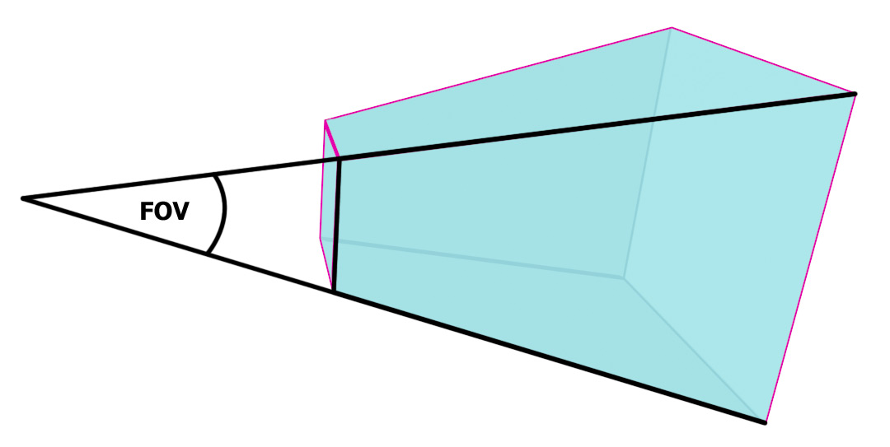
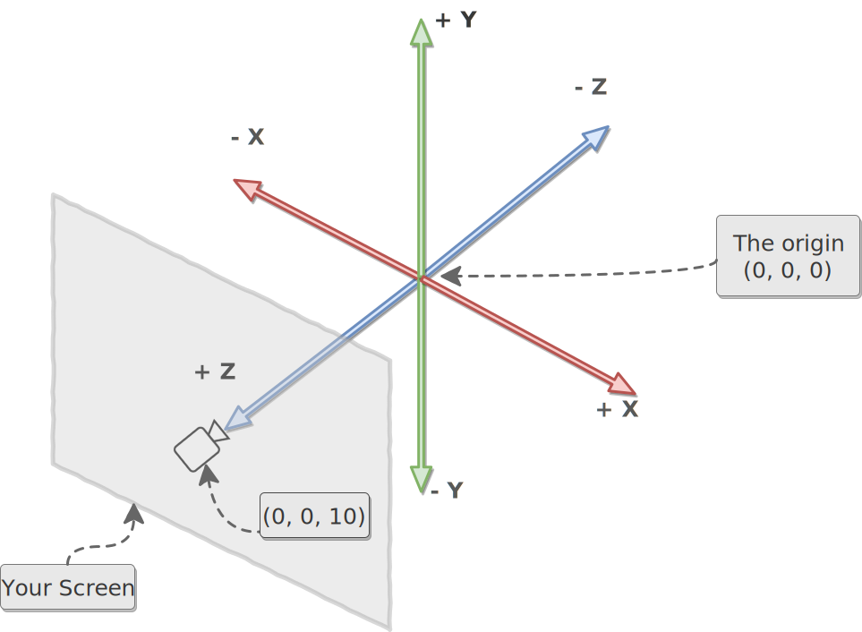

# three.js

## Camera

### Perspective Camera

> 参考于 <https://discoverthreejs.com/book/first-steps/first-scene/>。

> 参考于 <https://discoverthreejs.com/book/first-steps/first-scene/>。

> 参考于 <https://discoverthreejs.com/book/first-steps/first-scene/>。

## 坐标系

> 参考于 <https://discoverthreejs.com/book/first-steps/first-scene/>。
